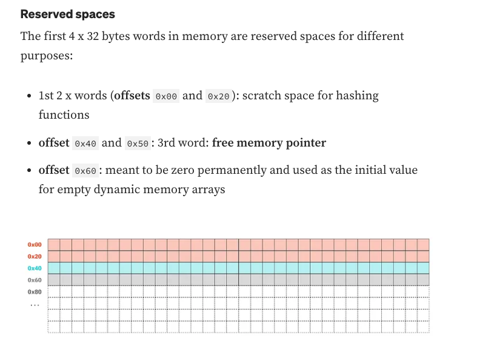

## MetaTrust CTF

- [Guess game challenge](https://github.com/MetaTrustLabs/ctf/tree/master/guessgame)
- Contracts:
    - `A`: single function contract
    - `MyToken`: simple ERC20 token
    - `GuessGame`: Guess 4 random values for `guessGame()` function based on the following init code:

`````
contract GuessGame {
    uint256 private immutable random01;
    uint256 private immutable random02;
    uint256 private immutable random03;
    A private  immutable random04;
    MyToken private immutable mytoken;

    constructor(A _a) {
        mytoken = new MyToken();

        random01 = uint160(msg.sender);
        random02 = uint256(keccak256(address(new A()).code));
        random03 = block.timestamp;
        random04 = _a; 
        pureFunc();
    }

    // pureFunc() runs in constructor memory context
    function pureFunc() pure internal {
        assembly{
            mstore(0x80,1)  // offset 128, sets random01 to 1
            mstore(0xa0,2) //  offset 160, sets random02 to 2
            mstore(0xc0,32) // offset 192, sets random03 to 32
        }
    }
    ...
`````````

- After constructor
    - random01: 1
    - random02: 2
    - random03: 32
    - random04: `A contract instance`

### Main game function:

`````
    function guess(uint256 _random01, uint256 _random02, uint256 _random03, uint256 _random04) external payable returns(bool){

        if(msg.value > 100 ether){
            // 100 eth! you are VIP!
        }else{
            uint256[] memory arr;
            uint256 money = msg.value;
            assembly{
                mstore(_random01, money)
            }
            require(random01 == arr.length,"wrong number01");
        }

        uint256 y = ( uint160(address(msg.sender)) + random01 + random02 + random03 + _random02) & 0xff;
        require(random02 == y,"wrong number02");

        require(uint160(_random03) < uint160(0x0000000000fFff8545DcFcb03fCB875F56bedDc4));
        (,bytes memory data) = address(uint160(_random03)).staticcall("Fallbacker()");
        require(random03 == data.length,"wrong number03");

        require(random04.number() == _random04, "wrong number04");

        mytoken.transfer(msg.sender,100);
        payable(msg.sender).transfer(address(this).balance);
        return true;
    }
`````
    
- Guessing
    - param _random01:
        - Constraint `require(random01 == arr.length,"wrong number01");`
        - random01 = `'0x60` or `96` because of [Memory reserved spaces](https://betterprogramming.pub/solidity-tutorial-all-about-memory-1e1696d71ee4) 
        - 
    - param _random02:
        - constraint:
        ```
        uint256 y = ( uint160(address(msg.sender)) + random01 + random02 + random03 + _random02) & 0xff;
        ```
        - & 0xff: masks the sum result and return the last 8 bits in binary.
        - I set random02 value to 0, comment out the masking `& 0xff` and print the `y` value, the result was a `big int _1` (long number)
        - I converted that number `big int _1` to binary representation using this [chrome extension](https://chrome.google.com/webstore/detail/dec-bin-hex-converter/ekpmhbdmofhgphjjbejkefeaebflacog) and modified the binary to make the last 8 bits represent the `number 2` or `00000010`, becasue I knew from constructor that `random02 = 2`
        - I converted the modified binary to back to decimal to get another big number `big int _2`, then I got the difference between both big integers`big int _1` & `big int _2` and in decimals and got the correct number to set, in my case
        `_random02 = 121`.
    - param _random03:
        - constraints:
        ````
        require(uint160(_random03) < uint160(0x0000000000fFff8545DcFcb03fCB875F56bedDc4));
        ```````
        ```
        (,bytes memory data) = address(uint160(_random03)).staticcall("Fallbacker()");
        ```
        ````
        require(random03 == data.length,"wrong number03");
        ````
        - At this point I know that `random03 = 32` so I used a single function helper contract that returns 32
        - Then some magic foundry fuzz to solve
        ```
            try helperContract.ctf(_random03)returns(uint256 dataSize){
                vm.assume(dataSize >= 32);
            }catch { console.log("Fuzzing..."); }
        ```
        - Ironically the right number was 3 so `_random03 = 3`
    - param _random04 was always 10

- I used cast to get address at stora slot 1 of `SetUp` contract:
````
cast storage <metatrust deployed address> 1
````

```
contract SetUp {
    A public a ;
    GuessGame public guessGame;

    constructor() payable {
        a = new A();
        guessGame = new GuessGame(a);
    }

    function isSolved() public view returns(bool) {
        return guessGame.isSolved();
    }
}
``````

- Finally sent a my guessGame() numbers with cast encoding the function name and params
- Used AI assitant [phind.com](https://www.phind.com/) to find faster the cast commands in the foundry docs.
